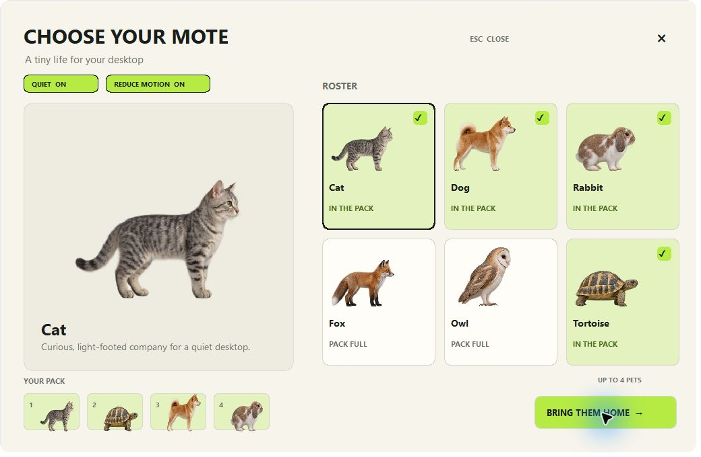

# Mote — the world's most overengineered desktop pet

Six small, realistic animals that live on your Windows desktop. Choose a
cat, Shiba Inu, lop rabbit, fox, barn owl, or tortoise from a game-style
character picker, put together a lineup of up to four pets, and bring them
home. No feeding chores, accounts, chat, or notifications.


## Pick a pet



Open Mote to see the native character picker. Browse the six animals, click
cards to add or remove them, and choose **Bring them home**. Your individual
lineup and preferences are saved. Double-click the tray icon or launch Mote
again to reopen selection. Windows startup uses your saved pets quietly.

The animals use detailed transparent raster artwork with eight source poses
per species. Their animation combines walking frames, anticipation, landing,
resting and sleeping poses with restrained procedural movement. They are
realistic 2D animals, not fully rigged 3D simulations. Artwork and generation
prompts are in [assets/pets](assets/pets/README.md).

## Quiet by default

- Small pets stay near the taskbar and leave application windows and the cursor alone.
- Fullscreen applications automatically hide and pause the pets.
- **Ctrl+Alt+M** hides or shows them immediately (if that shortcut is available).
- **Let clicks pass through pets** disables their mouse targets across applications.
- Quiet and Reduce Motion controls are in the picker; individual reactions and size are in the tray.
- Launch at startup is off until you enable it. Mote never asks for attention.

Turn Quiet off to enable optional window climbing, cursor play, audio and
system-load reactions. These settings can also be changed individually.
Click to pet an animal, drag to move it, and right-click for sleep, hide,
call-here and settings. Tortoises stay grounded; rabbits and owls use hops.

## Native desktop functionality

The Rust simulation uses real desktop, taskbar and window geometry. It
supports gravity, swept landings, moving-window support, jumping, optional
climbing, cursor startle and curiosity, idle sleep and waking. Species have
different movement capabilities, drives and cooldowns. Multiple pets share
one world snapshot and notice nearby companions.

The overlay uses native layered windows, per-pixel alpha and no-activation
styles. Rendering runs at about 30 frames/second when awake and about eight
when all pets are asleep. Hidden and fullscreen states reduce the timer to
four ticks/second and skip simulation/rendering. Geometry updates use
WinEvents with a periodic recovery refresh.

## Run

Windows 10/11 and current stable Rust are required to build. The resulting
executable includes all pet artwork and needs no Rust installation or webview.

```powershell
cargo run -p mote-app
cargo build --release -p mote-app
.\target\release\mote.exe
```

Optional commands:

```powershell
.\target\release\mote.exe --background  # start saved pets without the picker
.\target\release\mote.exe --quit        # close the running instance
.\target\release\mote.exe --self-test   # live sensor + simulation + render smoke
.\scripts\package.ps1                  # build a portable ZIP under target/package
```

[Quick start and removal](docs/QUICKSTART.md). Settings are stored in
`%APPDATA%\Mote\settings.json`, logs in `%LOCALAPPDATA%\Mote\mote.log`.
`MOTE_DATA_DIR` can point to an isolated local profile for development/QA.
Older fantasy-species settings migrate to the closest animal and retain
the user's previous settings.

## Architecture and checks

Four Rust crates keep Windows sensing, deterministic simulation, raster
rendering and application controls separate. The picker is a native Win32
window with GDI text and cached animal previews. There is no game engine or
browser runtime. See [architecture](docs/ARCHITECTURE.md) and
[build status and acceptance evidence](docs/BUILD_PLAN.md).

```powershell
cargo fmt --all -- --check
cargo clippy --workspace --all-targets -- -D warnings
cargo test --workspace
cargo run --release -p mote-render --example gallery
```

The gallery writes runtime character, pose and size sheets plus renderer
measurements to `target/mote-gallery`. Its timings exclude sensing, physics,
presentation and the picker. The native self-test is a smoke check, not a
substitute for observing desktop behaviour.

## Privacy and limits

Mote has no networking, analytics, telemetry, account or audio recording.
Window geometry stays in memory; titles are not stored. Audio reactions use
native playback information and an output volume scalar.

The portable Windows build is unsigned. Mixed-DPI hotplug, Explorer restart,
lock/resume and long-running multi-pet acceptance still require broader
hardware coverage. The animals have a finite raster pose set; independent
skeletal head/limb articulation, continuous flight and complex social play
are not implemented. See the build plan for current verification boundaries.
