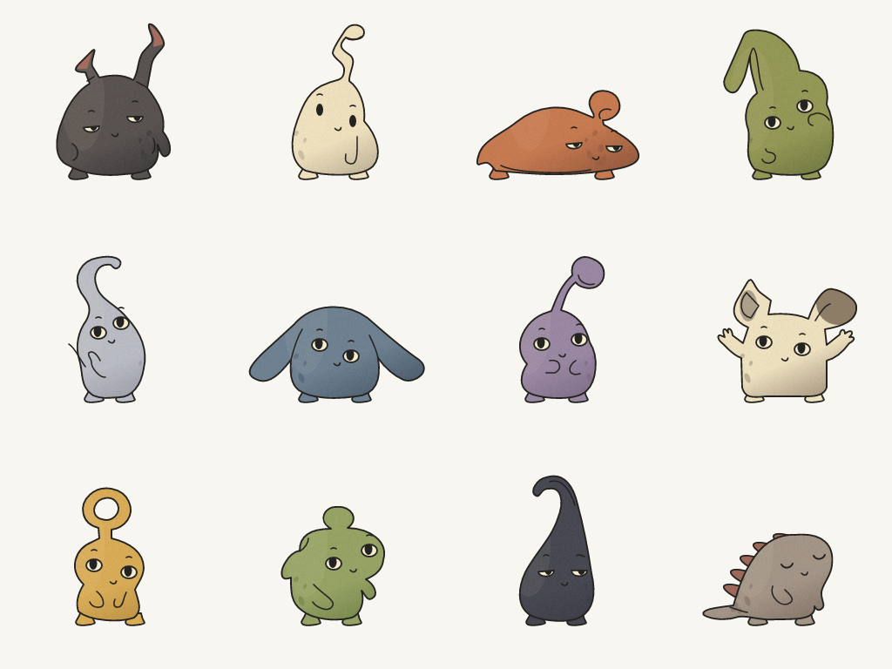

# Mote — the world's most overengineered desktop pet

Mote is a tiny animated creature that genuinely lives inside Windows. It is
not an assistant, chatbot, or productivity tool — it just lives on your
desktop: sitting on the taskbar, wandering along window edges, jumping
between windows, napping when you are away, and bouncing (very slightly) to
your music.


## The creatures



Twelve distinct inked silhouettes with muted colours, pigment texture,
asymmetric expressions and curved limbs. The runtime artwork follows the
vision board, with foot-anchored squash/stretch, tilt, blinks, gaze, antenna
sway, climbing grips, peeking fingers and a curled Ring-tail nap pose.
Choose a species and one to four Motes from the tray menu. Click targets
follow the visible artwork, including the transparent ring opening.

## What it does today

- **Lives on the taskbar** — spawns there, walks, sits, stretches, looks around.
- **Stands on real windows** — top edges of visible, non-minimised,
  non-cloaked windows become ledges via `EnumWindows` + DWM cloak checks.
- **Jumps between surfaces** — utility-scored jump targeting within its
  physical capability (300 px reach, 165 px rise), with anticipation stretch,
  airborne stretch, landing squash, and impact-scaled recovery.
- **Falls with gravity** — walks off edges, gets carried by windows that move
  underneath it, falls (with style) when a window disappears, and recovers to
  a safety net instead of ever getting stuck.
- **Sleeps when you are idle** (2 min, via `GetLastInputInfo`), wakes when you
  return. Sleeping poses, slow breathing, rising sleep marks.
- **Reacts to you** — gaze follows the cursor, fast approaches startle it
  (wide eyes, "o" mouth), slow nearby cursors invite chasing or curiosity,
  very close fast cursors make it scoot away. Click to pet it (blush + happy
  hop). Drag it anywhere and throw it — it tumbles, lands, and recovers.
- **Reacts to load** — sustained >85% CPU (via `GetSystemTimes`) triggers a
  wilted "this offends me" sulk with wavy mouth.
- **Reacts to music** — reads only the output peak meter
  (`IAudioMeterInformation`, no audio captured/stored/sent) and bobs;
  sustained playback + high spirits trigger an explicit dance.
- **System tray pet care** — sleep/wake, hide/show, call-it-here, size,
  per-reaction toggles, reduce-motion, pause-in-fullscreen, launch-at-startup.
- **Behaves coherently** — utility-scored state machine with minimum durations
  and cooldowns over drives (energy, curiosity, boredom, comfort, excitement,
  sleepiness, stress). No flapping, no Tamagotchi obligations.

## Run it

Requirements: Windows 10/11 and current stable Rust (matching CI).

```powershell
cargo run -p mote-app            # debug build (console window for logs)
cargo run -p mote-app -- --self-test   # headless sensor/sim/render smoke test
```

Release (no console window, LTO):

```powershell
cargo build --release -p mote-app
.\target\release\mote.exe
```

Settings persist to `%APPDATA%\Mote\settings.json`, logs to
`%LOCALAPPDATA%\Mote\mote.log`. Single-instance guarded.

## Architecture

Pure Rust, no game engine, no webview. Four crates with strict boundaries:

| Crate | Owns | Must never |
|---|---|---|
| `mote-core` | physics, world model, behaviour brain, drives/personality | touch any OS API |
| `mote-win` | monitors, DPI, taskbar, windows, cursor/idle, CPU/mem, audio meter, WinEvents | decide behaviour |
| `mote-render` | authored vector creatures, pigment texture and pose animation | know about Windows |
| `mote-app` | layered overlay, message loop, tray menu, settings, wiring | contain behaviour logic |

Why no Tauri/webview: the pet is a 256×256 software-rastered layered window
at ~30 fps. The renderer uses tiny-skia with cached paths and grain; it needs
no webview or game engine. See
[`docs/ARCHITECTURE.md`](docs/ARCHITECTURE.md).

## Privacy

Local-first. No account, no network calls, no telemetry, no analytics. The
audio path reads a loudness scalar only — capturing audio is impossible
through the API used. Window titles are never stored (only geometries are
kept in memory for physics).

## Known limitations

- Window-top ledges use the full top edge including title bars — Mote
  sometimes perches where a tab strip is. Endearing, mostly.
- Vertical climbing is implemented, but grip choreography and transitions
  still need polish. Most sleep poses deform the standing art; Ring-tail has
  a separate curled drawing whose transition still needs smoothing.
- Exact media play/stop metadata (SMTC) is not integrated; playback is
  inferred from sustained audio output, which also covers games/video.
- The tray icon hides in the Windows 11 overflow by default — drag it out.
- Single monitor thoroughly tested; multi-monitor works via the virtual-screen
  model but has had less soak time. See
  [`docs/BUILD_PLAN.md`](docs/BUILD_PLAN.md) for the full implemented vs
  remaining list.

## Check the artwork

```powershell
cargo run --release -p mote-render --example gallery
cargo fmt --all -- --check
cargo clippy --workspace --all-targets -- -D warnings
cargo test --workspace
```

The gallery writes actual runtime PNGs to `target/mote-gallery/`: twelve
transparent sprites, a light gallery, a dark pose sheet and all three sizes.
It also times 240 warm frames. The September art pass measured about 0.8 ms
per frame in release; that excludes simulation and Windows presentation.
The new Climber was observed on a real window edge. Extended multi-monitor
and four-pet performance acceptance remain open in the build plan.
